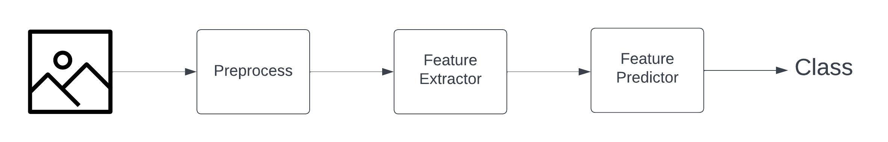

# feature-extraction-and-classification

This project enables image classification based on feature extraction.


## Project Structure

```
manufacturing-part-classification/
│
│
├── .github/                     # GitHub specific files like workflows for CI/CD
│   └── workflows/
│
├── .vscode/                     # VSCode specific settings, including debug configurations
│   └── launch.json
│
├── docs/                        # Sphinx documentation source files
│
├── src/                         # Source code for the project
│   ├── config/                  # Configuration files for all type of models
│   ├── dataloader/              # DataLoader implementation for the project
│   ├── model/                   # Model definitions and utilities
│   ├── scripts/                 # Scripts for training, evaluation, etc.
│   ├── utils/                   # Utility scripts for logging, data manipulation, etc.
│   └── launch.py                # Main script to launch training with configuration
│
├── .gitignore                   # Specifies intentionally untracked files to ignore
├── LICENSE                      # License file
└── README.md                    # Project overview and setup instructions
```

## Pipeline Overview

 
The pipeline is structured as follows:
- **Preprocess**: This step includes all necessary data transformation activities to ready the data for feature extraction.
- **Feature Extraction**: This involves the extraction of pertinent features from the preprocessed images, utilizing various methods like SIFT or VGG16.
- **Feature Prediction**: At this phase, the features that have been extracted are utilized to predict the categories of the manufacturing parts. The models used here may include K-NN, SVC, or RandomForest.

## Installation

```python
# Create Environment
conda create -n <env_name> python==3.9

#Activate environment
conda activate <env_name>

#Install dependencies
pip install numpy PyYAML opencv-python scikit-learn tensorflow==2.9.0

#Optional for generating documentation
pip install sphinx sphinx_rtd_theme
```

## Quick Start

### Training and Validation
```python
cd ./src

python ./launch.py --config <config_file>

#Example
python ./launch.py --config ./config/vgg16.yaml
```

### Testing
```python
python ./launch.py --config ./config/vgg16.yaml --test-only --weights <weights_file>
```

### Feature Visualization
```python
python ./launch.py --config <config_file> --visualization-only --weights <weights_file>
```

## Model Zoo
| Feature Extractor     | Link                                                              |
|-----------------------|-------------------------------------------------------------------|
| SIFTFeatureExtractor  | [class](./src/model/extractor_predictor/feature_extractor.py#115) |
| VGG16FeatureExtractor | [class](./src/model/extractor_predictor/feature_extractor.py#L34) |

| Feature Predictor     | Link                                                               |
|-----------------------|--------------------------------------------------------------------|
| RandomForestPredictor | [class](./src/model/extractor_predictor/feature_predictor.py#58)   |
| SVMPredictor          | [class](./src/model/extractor_predictor/feature_predictor.py#L137) |
| KNNPredictor          | [class](./src/model/extractor_predictor/feature_predictor.py#L96)  |

## Citation

If you find Manufacturing-Part-CLassification useful, please cite my work as an acknowledgment.

```bibtex
@misc{manufacturing-part-classification2024,
    title={Manufacturing Part Classification},
    author={Aleman Mihnea},
    howpublished={\url{https://github.com/SpeedyGonzales949/Manufacturing-Part-Classification}},
    year={2024}
}
```

